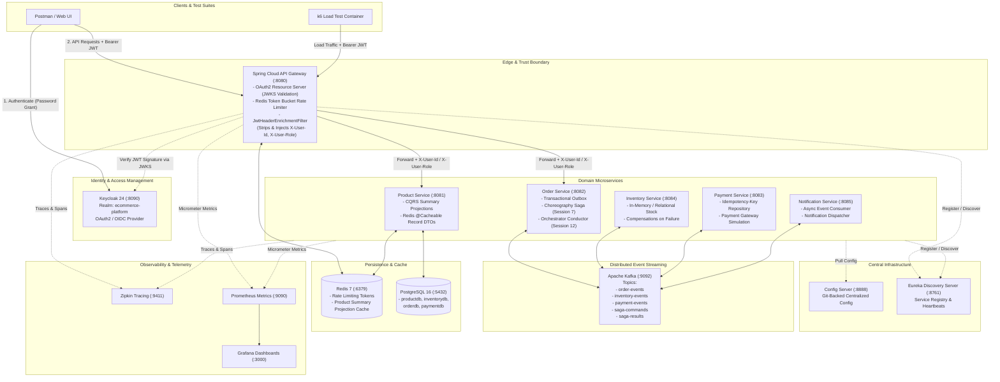

# Enterprise E-Commerce Microservices Platform

[](https://openjdk.org/)
[](https://spring.io/projects/spring-boot)
[](https://spring.io/projects/spring-cloud)
[](https://kafka.apache.org/)
[](https://www.keycloak.org/)
[](https://www.docker.com/)

A production-grade, distributed e-commerce platform engineered with **Spring Boot 3**, **Spring Cloud**, **Apache Kafka**, **Redis**, **PostgreSQL**, and **Keycloak**. The architecture demonstrates enterprise distributed systems patterns: **Trust Boundary Security**, **Distributed Sagas (Choreography & Orchestration)**, **Transactional Outbox**, **CQRS with Redis Caching**, **Token Bucket Rate Limiting**, **Idempotency**, and **Full Observability** with Zipkin, Prometheus, and Grafana.

---

## Table of Contents
1. [System Architecture & Design](#system-architecture--design)
2. [Component Overview & Port Map](#component-overview--port-map)
3. [Core Architectural Patterns](#core-architectural-patterns)
   - [1. Trust Boundary Security Pattern](#1-trust-boundary-security-pattern)
   - [2. Dual-Mode Distributed Sagas](#2-dual-mode-distributed-sagas)
   - [3. Transactional Outbox Pattern](#3-transactional-outbox-pattern)
   - [4. CQRS & Read Acceleration](#4-cqrs--read-acceleration)
   - [5. Redis Token Bucket Rate Limiting](#5-redis-token-bucket-rate-limiting)
   - [6. Idempotency Key Handling](#6-idempotency-key-handling)
4. [Quick Start (Docker Compose)](#quick-start-docker-compose)
5. [API Guide & End-to-End Testing](#api-guide--end-to-end-testing)
   - [Authentication (Keycloak)](#step-1-authenticate-via-keycloak)
   - [Product Catalog (Public)](#step-2-query-products-public-cqrs-read)
   - [Placing Orders (Choreography Saga)](#step-3-place-an-order-choreography-saga)
   - [Placing Orders (Orchestration Saga)](#step-4-place-an-order-orchestrated-saga)
   - [Idempotent Payment](#step-5-test-idempotent-payment)
6. [Performance & Load Testing (k6)](#performance--load-testing-k6)
7. [Observability & Monitoring](#observability--monitoring)
8. [Repository Structure](#repository-structure)

---

## System Architecture & Design

The platform uses a layered microservices topology. External traffic enters through a single hardened **API Gateway (Edge/Trust Boundary)** that verifies OAuth2/OIDC JWT tokens against Keycloak, strips untrusted headers, and injects authenticated user identities downstream. Asynchronous business workflows (order placement, inventory reservation, payment processing, notifications) communicate over **Apache Kafka**.



---

## Component Overview & Port Map

| Component | Port | Container Name | Technology | Description |
| :--- | :--- | :--- | :--- | :--- |
| **API Gateway** | `8080` | `api-gateway` | Spring Cloud Gateway, WebFlux | Single edge entry point; JWT validation, rate limiting, and header enrichment. |
| **Product Service** | `8081` | `product-service` | Spring Boot, JPA, Redis | Product catalog management with CQRS read projections and Redis cache. |
| **Order Service** | `8082` | `order-service` | Spring Boot, Kafka, Outbox | Order management; coordinates choreography and orchestration Sagas. |
| **Payment Service** | `8083` | `payment-service` | Spring Boot, JPA, Kafka | Payment simulation; handles idempotency keys and transactional outcomes. |
| **Inventory Service** | `8084` | `inventory-service` | Spring Boot, Kafka | Manages item reservations and compensation stock releases. |
| **Notification Service**| `8085` | `notification-service` | Spring Boot, Kafka | Consumes domain events and simulates email/SMS notifications. |
| **Eureka Server** | `8761` | `eureka-server` | Spring Cloud Netflix Eureka | Dynamic service registration and discovery. |
| **Config Server** | `8888` | `config-server` | Spring Cloud Config | Centralized configuration repository backed by Git. |
| **Keycloak** | `8090` | `keycloak` | Keycloak 24 (Quarkus) | Identity and Access Management (OAuth2 / OpenID Connect). |
| **PostgreSQL** | `5432` | `postgres` | PostgreSQL 16 Alpine | Relational database for microservices persistence. |
| **Redis** | `6379` | `redis` | Redis 7 Alpine | Distributed caching and rate-limiting token bucket storage. |
| **Apache Kafka** | `9092` | `kafka` | Apache Kafka (KRaft mode) | Distributed event streaming bus for asynchronous inter-service workflows. |
| **Zipkin** | `9411` | `zipkin` | OpenZipkin | Distributed tracing visualizer across HTTP and Kafka hops. |
| **Prometheus** | `9090` | `prometheus` | Prometheus | Time-series metrics scraper (Micrometer actuator endpoints). |
| **Grafana** | `3000` | `grafana` | Grafana | Central observability dashboards and performance monitoring. |

---

## Core Architectural Patterns

### 1. Trust Boundary Security Pattern
Security is enforced at the network perimeter (API Gateway):
1. **Perimeter Verification:** The API Gateway acts as an OAuth2 Resource Server. It validates token signatures and expiration directly against Keycloak’s JWKS endpoint (`http://keycloak:8080/realms/ecommerce-platform/protocol/openid-connect/certs`).
2. **Sanitization & Header Enrichment:** [`JwtHeaderEnrichmentFilter.java`](file:///f:/Microservice-Course/Enterprise%20E-Commerce%20Platform/Infrastructure/api-gateway/src/main/java/com/raya/api_gateway/filter/JwtHeaderEnrichmentFilter.java) strips any client-supplied `X-User-Id` or `X-User-Role` headers to prevent identity spoofing (IDOR). It extracts the verified `sub` UUID and role claims from the JWT, injecting them as trusted headers.
3. **Decoupled Downstream Services:** Core services (`order-service`, `inventory-service`) do not need heavy Spring Security OAuth2 dependencies. They read the pre-validated `X-User-Id` header directly.

### 2. Dual-Mode Distributed Sagas
The platform implements distributed transactions across `OrderService`, `InventoryService`, and `PaymentService`:

* **Choreography Saga (`POST /api/v1/orders`):**
  - Fully decentralized and event-driven.
  - `OrderService` writes order as `PENDING` and publishes `OrderPlacedEvent`.
  - `InventoryService` consumes `OrderPlacedEvent`, reserves stock, and emits `InventoryReservedEvent`.
  - `PaymentService` consumes `InventoryReservedEvent`, executes charge, and emits `PaymentCompletedEvent` (or `PaymentFailedEvent`).
  - If payment fails, `InventoryService` listens to `PaymentFailedEvent`, releases reserved stock (`InventoryReleasedEvent`), and `OrderService` updates order to `CANCELLED`.
* **Orchestration Saga (`POST /api/v1/orders/orchestrated`):**
  - Centralized conductor ([`OrderSagaOrchestrator.java`](file:///f:/Microservice-Course/Enterprise%20E-Commerce%20Platform/services/order-service/src/main/java/com/raya/order_service/saga/OrderSagaOrchestrator.java)).
  - The orchestrator sends explicit commands (`ReserveInventoryCommand`, `ProcessPaymentCommand`, `ReleaseInventoryCommand`) over `saga-commands` and processes typed replies on `saga-results`, tracking an explicit state machine.

### 3. Transactional Outbox Pattern
To prevent dual-write technical debt (committing to the database while failing to publish to Kafka), `order-service` persists the order and an `OutboxEvent` within the same local ACID transaction. A background scheduler ([`OutboxPublisher.java`](file:///f:/Microservice-Course/Enterprise%20E-Commerce%20Platform/services/order-service/src/main/java/com/raya/order_service/scheduler/OutboxPublisher.java)) polls the outbox and publishes events to Kafka with at-least-once delivery guarantees.

### 4. CQRS & Read Acceleration
* Catalog reads are segregated into optimized database projections (`ProductSummaryProjection`).
* Dynamic Spring Data JPA proxies are wrapped into serializable records ([`ProductSummaryDTO.java`](file:///f:/Microservice-Course/Enterprise%20E-Commerce%20Platform/services/product-service/src/main/java/com/raya/product_service/projection/ProductSummaryDTO.java)) and cached in Redis. Sub-10ms catalog latency is achieved without object serialization errors.

### 5. Redis Token Bucket Rate Limiting
Configured on the API Gateway using Spring Cloud Gateway's `RequestRateLimiter`:
- **Replenish Rate:** 10 tokens/sec
- **Burst Capacity:** 20 tokens
- **Key Resolver:** Client IP address (`@ipKeyResolver`)  
Traffic exceeding the token bucket is rejected with `HTTP 429 Too Many Requests`, safeguarding downstream services from traffic spikes.

### 6. Idempotency Key Handling
In [`PaymentController.java`](file:///f:/Microservice-Course/Enterprise%20E-Commerce%20Platform/services/payment-service/src/main/java/com/raya/payment_service/controller/PaymentController.java), requests must include an `Idempotency-Key` header. Repeated requests with the same key return the previously processed payment transaction, guaranteeing zero duplicate credit card or bank charges on network retries.

---

## Quick Start (Docker Compose)

### Prerequisites
* **Docker & Docker Compose** (Docker Desktop on Windows/macOS or Docker Engine on Linux)
* **Java 21 SDK** (for local development/builds)
* **Maven 3.9+** (or the included `./mvnw`)

### 1. Launch the Platform
From the project root:
```powershell
docker compose up -d
```

### 2. Verify Services Health
Check that all containers are healthy:
```powershell
docker compose ps
```

Key web portals:
* **Eureka Service Registry:** [http://localhost:8761](http://localhost:8761)
* **Keycloak Admin Console:** [http://localhost:8090](http://localhost:8090) *(Admin: `admin` / `admin`)*
* **Zipkin Distributed Tracing:** [http://localhost:9411](http://localhost:9411)
* **Prometheus Metrics:** [http://localhost:9090](http://localhost:9090)
* **Grafana Dashboards:** [http://localhost:3000](http://localhost:3000) *(Login: `admin` / `admin`)*

---

## API Guide & End-to-End Testing

### Step 1: Authenticate via Keycloak
Fetch an OAuth2 Access Token for user `customer1`:

```powershell
$token = (Invoke-RestMethod `
  -Uri "http://localhost:8090/realms/ecommerce-platform/protocol/openid-connect/token" `
  -Method Post `
  -ContentType "application/x-www-form-urlencoded" `
  -Body @{
    client_id     = "api-gateway"
    client_secret = "bUpznLTC5HZK8VVLfXMDPn5VDjYFn9s5"
    grant_type    = "password"
    username      = "customer1"
    password      = "password"
  }).access_token
```

### Step 2: Query Products (Public CQRS Read)
Public route (no authorization header required):
```http
GET http://localhost:8080/api/v1/products
```
**Response (`200 OK`):**
```json
[
  {
    "id": 1,
    "name": "Smartphone X",
    "price": 999.99,
    "categoryName": "Electronics"
  }
]
```

### Step 3: Place an Order (Choreography Saga)
Send order request through the Gateway. The customer identity is automatically extracted from your Keycloak token:
```http
POST http://localhost:8080/api/v1/orders
Authorization: Bearer <TOKEN>
Content-Type: application/json

{
  "productId": "PROD-001",
  "quantity": 1,
  "amount": 100.00
}
```
**Response (`200 OK`):**
```json
{
  "orderId": "fe5a660c-462b-4b06-8a6f-e2f6f33844f5",
  "status": "PENDING",
  "message": "Order received — processing..."
}
```

Check the order status 1-2 seconds later:
```http
GET http://localhost:8080/api/v1/orders/fe5a660c-462b-4b06-8a6f-e2f6f33844f5/status
Authorization: Bearer <TOKEN>
```
**Response:** `CONFIRMED` (or `CANCELLED` if payment was declined).

### Step 4: Place an Order (Orchestrated Saga)
Hits the explicit central conductor orchestrator:
```http
POST http://localhost:8080/api/v1/orders/orchestrated
Authorization: Bearer <TOKEN>
Content-Type: application/json

{
  "productId": "PROD-001",
  "quantity": 1,
  "amount": 100.00
}
```

### Step 5: Test Idempotent Payment
```http
POST http://localhost:8080/api/v1/payments
Idempotency-Key: pay-key-unique-001
Content-Type: application/json

{
  "orderId": "order-100",
  "amount": 100.00
}
```
Re-sending the exact same request with `pay-key-unique-001` returns the cached payment transaction without creating a duplicate record.

---

## Performance & Load Testing (k6)

The project includes pre-configured **k6** load and smoke test scripts inside the [`k6/`](file:///f:/Microservice-Course/Enterprise%20E-Commerce%20Platform/k6) directory.

### Running Smoke Test (Public Catalog)
```powershell
docker run --rm `
  --network "enterprisee-commerceplatform_platform-net" `
  -v "${PWD}/k6:/scripts" `
  -e BASE_URL="http://api-gateway:8080" `
  grafana/k6 run /scripts/smoke-test.js
```

### Running Order Load Test (Authenticated)
```powershell
docker run --rm `
  --network "enterprisee-commerceplatform_platform-net" `
  -v "${PWD}/k6:/scripts" `
  -e BASE_URL="http://api-gateway:8080" `
  -e TEST_JWT="$token" `
  grafana/k6 run /scripts/order-load-test.js
```

---

## Observability & Monitoring

### Distributed Tracing (Zipkin)
Every HTTP request passing through the Gateway and every Kafka message published/consumed across services carries W3C / B3 trace propagation headers.
1. Open **`http://localhost:9411`**.
2. Click **Find Traces**.
3. View the waterfall diagram showing the exact millisecond duration of Gateway routing, Kafka publishing, and asynchronous consumer execution.

### Metrics & Dashboards (Prometheus + Grafana)
Each microservice exposes Prometheus metrics via Spring Boot Actuator (`/actuator/prometheus`).
1. Open Grafana at **`http://localhost:3000`** (`admin` / `admin`).
2. Add Prometheus (`http://prometheus:9090`) as data source.
3. Import JVM / Spring Boot dashboard (ID `11378` or `12900`) to observe active threads, heap memory, garbage collection, and HTTP request throughput in real time.

---

## Repository Structure

```
Enterprise E-Commerce Platform/
├── docker-compose.yml              # Multi-container orchestration definition
├── Infrastructure/
│   ├── api-gateway/                # Spring Cloud Gateway (Edge, Security, Rate Limiter)
│   ├── config-server/              # Spring Cloud Config Server
│   ├── discovery-server/           # Netflix Eureka Service Registry
│   └── postgres/
│       └── init-dbs.sql            # Database schema initializations
├── services/
│   ├── product-service/            # Product catalog, CQRS projections, Redis cache
│   ├── order-service/              # Sagas (Choreography/Orchestration), Outbox pattern
│   ├── inventory-service/          # Stock reservation & compensation logic
│   ├── payment-service/            # Payment simulation & idempotency repository
│   └── notification-service/       # Kafka event listener for notifications
├── keycloak/
│   └── realm-export.json           # Keycloak realm definition (clients, users, roles)
├── k6/
│   ├── smoke-test.js               # Gateway & product smoke test script
│   └── order-load-test.js          # Staged order ramp-up load test script
└── DEMO_GUIDE.md                   # Interview & stakeholder showcase guide
```

---

## License & Attribution
Developed as part of the **Advanced Microservices Professional Platform Course**. Engineered for demonstration of enterprise patterns in distributed Java systems.
